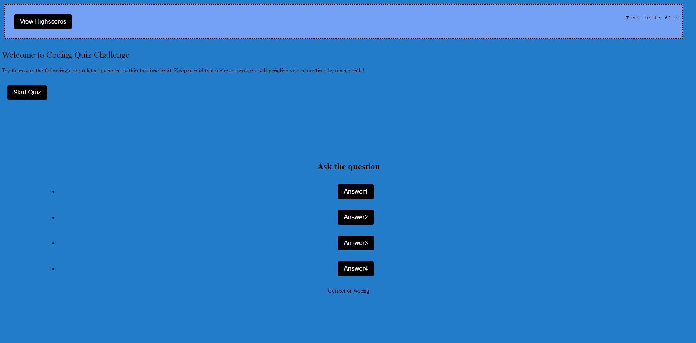
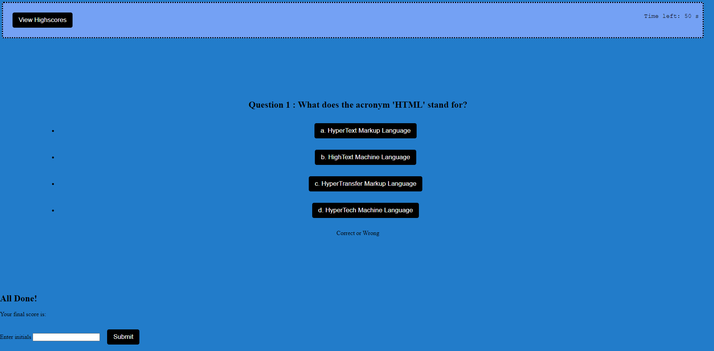

# Coding-Mini-Quiz
A short 10 question coding quiz that is timed

# User Story
AS A coding boot camp student
I WANT to take a timed quiz on JavaScript fundamentals that stores high scores
SO THAT I can gauge my progress compared to my peers

# Acceptance Criteria
GIVEN I am taking a code quiz
WHEN I click the start button
THEN a timer starts and I am presented with a question
WHEN I answer a question
THEN I am presented with another question
WHEN I answer a question incorrectly
THEN time is subtracted from the clock
WHEN all questions are answered or the timer reaches 0
THEN the game is over
WHEN the game is over
THEN I can save my initials and score

# Mock-up Image of the Site

# Link to Live Site
https://thomas-barnhart.github.io/Coding-Mini-Quiz/

# Link to GitHub
https://github.com/Thomas-Barnhart/Coding-Mini-Quiz

# Final Use
A short 10 question coding quiz to test your knowledge if you get a question wrong then it will deduct time from completing the quiz.
